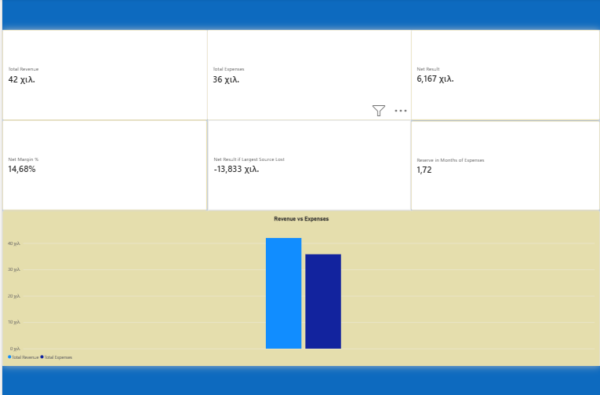
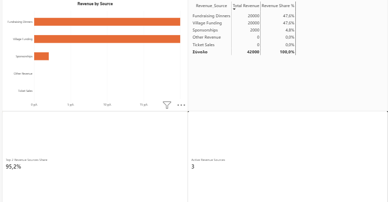
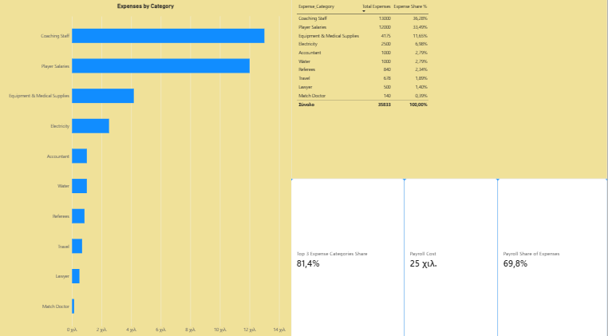
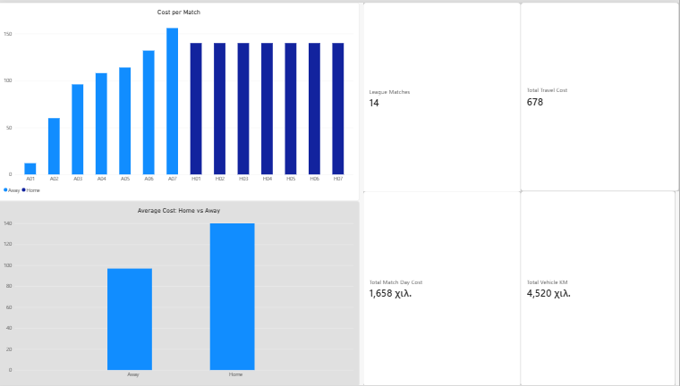

# Football Club Financial Sustainability Analysis

**Excel → SQL → Statistics → Power BI**

A small amateur football club tracked its season finances in an Excel workbook. This project transforms that operational spreadsheet into a validated financial analysis designed to answer a practical management question:

> **Is the club financially sustainable, where is the main financial risk, and where should management focus next season?**

The analysis combines Excel, SQLite/SQL, Python validation, descriptive statistics and Power BI to move from raw financial records to business-focused conclusions.

---

## Executive summary

The club finishes the season with:

* **€42,000 revenue**
* **€35,833 expenses**
* **€6,167 surplus**
* **14.7% net margin**

The headline result is positive, but the financial position is more fragile than the surplus alone suggests.

**95.2% of total revenue comes from only two sources:** Fundraising Dinners (€20,000) and Village Funding (€20,000).

If the largest €20,000 revenue source were lost and not replaced, the club would move from a **€6,167 surplus to a €13,833 deficit**.

On the cost side, payroll is the main structural cost:

* **€25,000 payroll**
* **69.8% of total expenses**
* Coaching staff and player salaries together represent €25,000.

Match-day costs are comparatively small:

* **€1,658 total match-day cost**
* **€678 travel cost**
* **14 matches**
* **4,520 vehicle kilometres**

### Bottom line

The main financial risk is **revenue concentration rather than match-day spending**.

The club is profitable for the season, but its ability to repeat that result depends heavily on a small number of revenue sources.

---

## Business context

### Stakeholder

The primary stakeholder is the **club board / treasurer**, with relevance to sporting and fundraising management.

### Business decision

The analysis is intended to support next-season planning by answering:

1. Is the club operating with a surplus?
2. How dependent is the club on a small number of revenue sources?
3. Which expense categories have the greatest financial impact?
4. Are match-day costs a meaningful cost-control opportunity?
5. What happens if revenue falls or expenses increase?
6. Where should management focus its attention for the next season?

The goal is therefore not simply to report historical numbers.

It is to identify **financial vulnerabilities and practical management priorities**.

---

## Key findings

### 1. The club is profitable, but the surplus provides limited protection

Revenue is **€42,000** against **€35,833** of expenses, producing a **€6,167 surplus** and a **14.7% net margin**.

However, the surplus is relatively small compared with the club's overall financial activity.

A combined scenario of:

* **Revenue −10%**
* **Expenses +10%**

would turn the €6,167 surplus into approximately a **€1,616 loss**.

**Business impact:** the club has a positive current result, but relatively limited tolerance for simultaneous revenue pressure and cost increases.

**Recommended action:** next-season planning should protect recurring revenue and monitor major cost commitments before smaller operating costs.

**Suggested owner:** Club Board / Treasurer.

**Suggested KPIs:**

* Net Result €
* Net Margin %
* Revenue €
* Expenses €
* Surplus-equivalent Months of Expenses

---

### 2. Revenue concentration is the largest identified financial risk

Fundraising Dinners generate **€20,000** and Village Funding generates **€20,000**.

Together they account for:

**95.2% of total revenue.**

Only three revenue sources are active:

* Fundraising Dinners — €20,000
* Village Funding — €20,000
* Sponsorships — €2,000

Ticket sales and other revenue contribute €0 in the analysed season.

If the largest €20,000 source were lost without replacement:

**€22,000 revenue**

against:

**€35,833 expenses**

would produce a:

**€13,833 deficit.**

**Business impact:** the club's positive result is highly dependent on a small number of revenue sources.

**Recommended action:** build additional and more recurring revenue streams rather than relying on one-off or concentrated sources.

**Suggested owner:** Club Board / Fundraising & Sponsorship Lead.

**Suggested KPIs:**

* Top 2 Revenue Sources Share %
* Recurring Revenue €
* Sponsorship Revenue €
* Secured Replacement Revenue €
* Number of Active Revenue Sources

A useful management target would be to reduce the concentration of the top two sources over time rather than simply increasing total revenue.

---

### 3. Payroll is the main cost lever

Payroll totals **€25,000**, representing **69.8% of total expenses**.

The largest expense categories are:

1. Coaching Staff — €13,000
2. Player Salaries — €12,000
3. Equipment — €4,175

These three categories represent approximately **81.4% of total expenses**.

Seven of the seventeen expense categories have no cost in the analysed season.

**Business impact:** small operating-cost reductions are unlikely to materially change the financial result compared with decisions affecting payroll or other major cost categories.

**Recommended action:** review major staffing and player-cost commitments before focusing on low-value operational savings.

**Suggested owner:** Club Board / Sporting Management.

**Suggested KPIs:**

* Payroll €
* Payroll % of Total Expenses
* Coaching Cost €
* Player Cost €
* Net Result €
* Major Cost Category Share %

---

### 4. Match-day costs are not the primary financial pressure

Total match-day costs are **€1,658** across 14 matches.

Home matches have a fixed cost of **€140** for referees and the match doctor.

Away-match travel ranges from **€12 to €156**, with an average travel cost of approximately **€96.9**.

Total travel cost is **€678** for **4,520 vehicle kilometres**.

Compared with the €25,000 payroll cost, match-day spending is relatively small.

**Business impact:** aggressive reductions in match-day spending are unlikely to solve the club's main financial problem.

**Recommended action:** maintain existing match-day controls, but prioritize revenue diversification and major cost commitments.

**Suggested owner:** Treasurer / Operations Lead.

**Suggested KPIs:**

* Average Match-Day Cost €
* Travel Cost per Away Match €
* Travel Cost €
* Payroll %
* Net Result €

---

## What / Why / So What / Now What

| Level        | Finding                                                                                                                                           |
| ------------ | ------------------------------------------------------------------------------------------------------------------------------------------------- |
| **What**     | The club generates €42,000 revenue and €35,833 expenses, producing a €6,167 surplus.                                                              |
| **Why**      | Revenue is highly concentrated, while payroll represents 69.8% of expenses.                                                                       |
| **So What**  | The current surplus is vulnerable to losing a major revenue source or facing simultaneous revenue and cost pressure.                              |
| **Now What** | Diversify revenue, protect recurring funding, review major payroll commitments, and maintain rather than over-prioritize match-day cost controls. |

This is the main business story of the project.

---

## Scenario analysis

Because the dataset covers only one season, historical trend analysis is not possible.

Instead, the project uses simple scenario analysis to test the sensitivity of the current financial result.

| Scenario                       | Revenue | Expenses |   Net Result |
| ------------------------------ | ------: | -------: | -----------: |
| Base case                      | €42,000 |  €35,833 |  **+€6,167** |
| Revenue −10%                   | €37,800 |  €35,833 |  **+€1,967** |
| Expenses +10%                  | €42,000 |  €39,416 |  **+€2,584** |
| Revenue −10% and Expenses +10% | €37,800 |  €39,416 |  **−€1,616** |
| Largest €20,000 source lost    | €22,000 |  €35,833 | **−€13,833** |

### Scenario takeaway

The club can absorb either a moderate revenue decline or a moderate increase in expenses while remaining profitable.

It cannot comfortably absorb both at the same time.

The largest identified downside is the loss of the €20,000 revenue source, which demonstrates why **revenue concentration is the most important financial risk to address**.

---

## Analysis pipeline

The project uses the following workflow:

```text
Excel source data
       ↓
SQL database
       ↓
Data-quality validation
       ↓
Descriptive statistics
       ↓
Power BI reporting
       ↓
Business insights & recommendations
```

Each layer has a different purpose:

| Layer                 | Purpose                                                            |
| --------------------- | ------------------------------------------------------------------ |
| **Excel**             | Original operational financial data                                |
| **SQL**               | Structured storage, transformations, analytical views and controls |
| **Python**            | Automated database build and validation testing                    |
| **Statistics**        | Concentration, shares, averages and scenario analysis              |
| **Power BI**          | Executive-facing visual reporting                                  |
| **Business analysis** | Translate findings into management priorities                      |

---

## Why only descriptive statistics?

The dataset covers one complete season and represents the whole club rather than a statistical sample.

Therefore, descriptive measures such as:

* totals
* shares
* averages
* minimum / maximum
* category comparisons
* concentration measures
* scenario analysis

are appropriate.

Hypothesis tests and confidence intervals are not used because there is not enough independent time-series or sample-level data to support meaningful statistical inference.

---

## Data validation

Data quality is a central part of the project rather than an afterthought.

### Excel ↔ SQL

All 11 data tables were compared cell by cell.

**Result: 0 differences**, including calculated columns.

### Excel formulas

Workbook formulas were independently recalculated.

**Result:**

* 0 formula errors
* 0 differences from stored values
* 65/65 workbook checks passed

### SQL control checks

The SQL layer contains **80 control checks** covering:

* totals
* row counts
* referential integrity
* parameter consistency
* money precision
* reconciliation between related tables
* join integrity
* cross-table consistency

**Result: 80/80 passed.**

The controls include reconciliations that do not rely on manually typed expected totals. For example, the Staff table is reconciled against the Coaching Staff expense category.

### Constraint tests

The automated test suite attempts invalid inserts and updates such as:

* unknown revenue source
* negative amounts
* invalid Home/Away values
* travel recorded for a home match
* invalid foreign-key references
* invalid in-kind costs
* duplicate primary keys
* NULL values where prohibited

**Result: 12/12 invalid operations rejected.**

### Mutation tests

The project also intentionally changes values in source tables to verify that the validation layer detects the resulting inconsistency.

**Result: 6/6 mutations detected.**

### Power BI validation

Power BI outputs were compared against the underlying source numbers and SQL outputs.

The report contains **21 DAX measures** documented in `DAX_Measures.txt`.

---

# Power BI report

The Power BI report contains four pages designed around the main business questions rather than around technical features.

## 1. Overview — The club is profitable, but the surplus provides limited protection

The overview page shows:

* Revenue
* Expenses
* Net Result
* Net Margin
* Net Result if the largest revenue source is lost
* Surplus-equivalent months of expenses
* Revenue vs expenses

The purpose is to answer the first management question immediately:

**What is the overall financial position?**



---

## 2. Revenue — 95.2% of revenue comes from two sources

The revenue page shows revenue by source, share of total revenue, top-two source concentration and number of active revenue sources.

Key finding:

**Two sources account for 95.2% of total revenue.**



---

## 3. Expenses — Payroll absorbs 69.8% of total expenses

The expenses page shows expense categories and highlights the concentration of spending.

Key metrics:

* Top 3 categories share — **81.4%**
* Payroll — **€25,000**
* Payroll share — **69.8%**

Categories with zero cost are excluded from the main visual to keep the analysis focused on actual spending.



---

## 4. Matches — Match-day costs are small relative to major operating costs

The matches page shows:

* cost per match
* home vs away costs
* total match-day cost
* total travel cost
* vehicle kilometres
* number of matches

Key metrics:

* **14 matches**
* **€1,658 match-day cost**
* **€678 travel cost**
* **4,520 vehicle kilometres**



> **Power BI note:** The report was built in a Greek-language Power BI environment. A card showing `42,000 χιλ.` represents **€42,000** (`χιλ.` = thousand). Decimal commas follow the Greek locale.

---

## Power BI model

The Power BI model contains seven tables:

* `tbl_Revenue`
* `tbl_Expenses`
* `tbl_Staff`
* `tbl_Players`
* `tbl_Travel`
* `tbl_Match_Costs`
* `tbl_Team_Info`

The model uses one relationship:

```text
tbl_Travel[Match_ID]
        ↓
tbl_Match_Costs[Match_ID]
```

This relationship allows travel costs to be associated with the corresponding away match.

The 21 DAX measures used in the report are documented in:

`DAX_Measures.txt`

---

## Data model and SQL design

The SQLite layer separates operational tables from analytical views.

The analytical layer includes views for:

* overall KPI summary
* revenue by source
* expenses by category
* expenses by type
* payroll
* match-day costs
* control checks

The SQL design also uses safeguards such as:

* explicit column selection
* `LEFT JOIN` for dimension-to-fact relationships
* separate aggregation of detail tables to avoid join fan-out
* `COALESCE` for safe aggregation
* `NULLIF` for percentage calculations
* constraints and triggers for invalid data
* reconciliation checks across related tables

This ensures that the analytical layer is not simply a collection of ad-hoc queries.

---

## Source data

The original source workbook used during the project is **not included in the repository**.

For reproducibility, the SQL layer contains the complete analytical dataset used by the project through `02_data.sql`.

The database can therefore be rebuilt and validated independently using:

* `01_schema.sql`
* `02_data.sql`
* `03_views.sql`
* `04_validation.sql`
* `build_and_test.py`

The Power BI report and statistical analysis are based on the same underlying dataset.

---

## Repository structure

The repository is intentionally kept flat so that the actual structure matches the documentation:

```text
football-club-finance-analysis/
├── README.md
├── 01_schema.sql
├── 02_data.sql
├── 03_views.sql
├── 04_validation.sql
├── build_and_test.py
├── DAX_Measures.txt
├── Football_Club_Finance_v2.pbix
├── Football_Club_Statistics.xlsx
├── 01_overview.png
├── 02_revenue.png
├── 03_expenses.png
└── 04_matches.png
```

### Main files

* **`01_schema.sql`** — Database schema, tables, constraints, indexes and triggers.
* **`02_data.sql`** — Analytical source data loaded into the SQLite database.
* **`03_views.sql`** — Analytical views, KPI calculations and data-quality control checks.
* **`04_validation.sql`** — Additional read-only validation and integrity checks.
* **`build_and_test.py`** — Automated database build and validation test suite.
* **`DAX_Measures.txt`** — DAX measures used in the Power BI model.
* **`Football_Club_Finance_v2.pbix`** — Final Power BI dashboard.
* **`Football_Club_Statistics.xlsx`** — Statistical analysis workbook.
* **`01_overview.png` – `04_matches.png`** — Dashboard screenshots used for project documentation.

---

## How to run

### SQL / Python

Requirements:

* Python 3
* Standard library only

From the repository root:

```bash
python build_and_test.py
```

The script rebuilds the SQLite database and runs the automated validation and test suite.

The expected final line is:

```text
RESULT: ALL PASSED
```

`04_validation.sql` contains additional read-only queries that can be executed in any SQLite client.

### Power BI

Open:

```text
Football_Club_Finance_v2.pbix
```

The report contains the final dashboard and DAX measures used for the analysis.

---

## Recommendations

Based on the analysis, the recommended priorities for the next season are:

### Priority 1 — Reduce revenue concentration

The club should avoid relying on two sources for approximately 95% of revenue.

**Actions:**

* develop additional sponsorship opportunities
* establish more recurring revenue
* identify replacement revenue before the season begins
* monitor the concentration of the largest revenue sources

**Primary KPI:** Top 2 Revenue Sources Share %

---

### Priority 2 — Protect the largest revenue commitments

Because losing the €20,000 largest source would create a €13,833 deficit, renewal of major revenue sources should be treated as a financial planning priority.

**Actions:**

* confirm major funding commitments early
* track secured vs unsecured revenue
* maintain a replacement-revenue pipeline

**Primary KPIs:**

* Secured Revenue €
* Recurring Revenue €
* Revenue at Risk €

---

### Priority 3 — Review major cost commitments

Payroll represents 69.8% of expenses.

**Actions:**

* review coaching and player-cost commitments
* assess major contracts before the next season
* monitor payroll as a percentage of total expenses

**Primary KPI:** Payroll % of Total Expenses

---

### Priority 4 — Maintain, rather than over-optimize, match-day costs

Match-day spending is relatively small compared with payroll and other major categories.

**Actions:**

* keep existing travel and match-day controls
* monitor unusually expensive away trips
* avoid sacrificing higher-impact areas to achieve small match-day savings

**Primary KPIs:**

* Average Match-Day Cost €
* Travel Cost per Away Match €

---

## Limitations

* The analysis covers **one season only**, so year-over-year trends and long-term financial trends cannot be established.
* The dataset does not contain transaction-level dates; periods are represented by season labels.
* The original source workbook is not included in the repository. The analytical dataset is reproducible from `02_data.sql`.
* The project validates internal consistency and data integrity, but it does not independently verify financial figures against bank statements, invoices, receipts or other external accounting records.
* The statistics workbook contains values derived from the analytical data. If the underlying data changes, the workbook must be refreshed manually.
* The 21 Power BI measures were validated against the source numbers and SQL outputs; they are not covered by an automated Power BI testing framework.
* The analysis identifies financial risks from the available data but does not forecast future revenue or expenses.

---

## Tools

* **Excel** — original financial data and supporting analysis
* **SQLite / SQL** — database design, analytical views, KPI calculations and validation
* **Python** — automated database build and validation testing
* **Power BI / DAX** — interactive financial dashboard and KPI reporting

---

## Final takeaway

The club finishes the season in a positive financial position, but the result is not equally strong across all dimensions.

The key finding is not simply:

> **"The club made €6,167."**

It is:

> **"The club made €6,167, but 95.2% of its revenue came from two sources, making revenue concentration the main financial risk."**

The analysis therefore shifts the management focus from simply reporting the current surplus to answering the more useful question:

**How can the club make that surplus more repeatable and financially resilient next season?**
